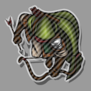

# Vision Toolkit


[](https://forge-vtt.com/bazaar#package=vision-toolkit)


[](https://www.foundryvtt-hub.com/package/vision-toolkit/)


[](https://weblate.foundryvtt-hub.com/engage/vision-toolkit/)

### If you want to buy me a coffee [](https://www.patreon.com/p4535992)

A module that packs the features from those 5-6 modules scattered around that help manage GM/Player visualization and other little things that people don't download (or known) because they don't want to have too many modules installed ....
As always, I invite you to consult the list of `credits` and support the single developers for each individualfeatures.
Here the module list i have tried to "merge" in this single module:

- [Ignore Vision](https://github.com/manuelVo/foundryvtt-ignore-vision/tree/master)
- [GM Token Drag Visibility v2](https://github.com/MAClavell/gm-token-drag-visibility-v2)
- [No Token Vision Animation](https://github.com/MAClavell/No-Token-Vision-Animation/)
- [Invisible tokens can see too](https://github.com/soemer/invisible-tokens-can-see-too)
- [Don't reveal my map](https://github.com/soemer/do-not-reveal-my-map)
- [token-warp](https://github.com/thatlonelybugbear/token-warp)
- [GM Vision](https://github.com/dev7355608/gm-vision)

## Features

- **Disable vision on the canvas for GM**: Adds a toggle to GM's token control menu, that allows them to ignore the vision of tokens. This makes it possible to see the entire map while moving tokens with vision around. This is managed from scene control setting

  The vision mode is toggled by a keybinding (default: `CTRL+I`). The light bulb icon of the lighting controls button indicates whether it's active (: inactive; : active).

- **Disable vision on Drag and Drop for GM**: The module provides the feature to disables the vision limitation when dragging a token as GM. Useful for not show the map to player when you move some token on the map. This is managed from a module setting.

- **[Embedded feature of [GM Vision](https://github.com/dev7355608/gm-vision)]** The module provides the feature to remove token movement animations for the GM. Useful if you hate to see the movement of the token on the map. This is managed from a module setting. **NOTE:** This module work very well with the module [GM Vision](https://github.com/dev7355608/gm-vision) if you disable the module settings "_Enable GM Vision_"

  - This module adds a toggleable mode for GMs that ...
  - increases the brightness of the scene,
  - reveals the fog of war, and
  - shows all tokens even if they wouldn't be visible normally from the perspective of the selected token.

    Tokens that wouldn't be visible normally are highlighted by a hatched overlay.

    

    The mode is toggled by a keybinding (default: `CTRL+G`). The light bulb icon of the lighting controls button indicates whether it's active (: inactive; : active).

- **Invisible tokens can see too:** allows tokens to be invisible and keeping their sight. This allows a player to be invisible to the rest of group and sneak around without the other players knowing the position. By default invisible tokens loose sight. If you check this setting, this behavior changes.

- **Invisible tokens can light too:** Tokens with a light source still emit light if they are invisible.

- **Don't reveal my map:** Do not reveal the map if a player token gets moved through a wall. Cancels the animation of a token if it would be moved through a wall to prevent showing parts of a map a player should not be able to see.

## Installation

It's always easiest to install modules from the in game add-on browser.

To install this module manually:
1.  Inside the Foundry "Configuration and Setup" screen, click "Add-on Modules"
2.  Click "Install Module"
3.  In the "Manifest URL" field, paste the following url:
`https://raw.githubusercontent.com/p4535992/foundryvtt-vision-toolkit/master/src/module.json`
4.  Click 'Install' and wait for installation to complete
5.  Don't forget to enable the module in game using the "Manage Module" button

### libWrapper

This module uses the [libWrapper](https://github.com/ruipin/fvtt-lib-wrapper) library for wrapping core methods. It is a hard dependency and it is recommended for the best experience and compatibility with other modules.

## Known Issue\Limitation

## Api

TODO...

# Build

## Install all packages

```bash
npm install
```

### dev

`dev` will let you develop you own code with hot reloading on the browser

```bash
npm run dev
```

### build

`build` will build and set up a symlink between `dist` and your `dataPath`.

```bash
npm run build
```

### build:watch

`build:watch` will build and watch for changes, rebuilding automatically.

```bash
npm run build:watch
```

### prettier-format

`prettier-format` launch the prettier plugin based on the configuration [here](./.prettierrc)

```bash
npm run-script prettier-format
```

### lint

`lint` launch the eslint process based on the configuration [here](./.eslintrc.json)

```bash
npm run-script lint
```

### lint:fix

`lint:fix` launch the eslint process with the fix argument

```bash
npm run-script lint:fix
```

## [Changelog](./CHANGELOG.md)

## Issues

Any issues, bugs, or feature requests are always welcome to be reported directly to the [Issue Tracker](https://github.com/p4535992/foundryvtt-vision-toolkit/issues ), or using the [Bug Reporter Module](https://foundryvtt.com/packages/bug-reporter/).

## License

- **[Ignore Vision](https://github.com/manuelVo/foundryvtt-ignore-vision/tree/master)**: [MIT]()
- **[GM Token Drag Visibility v2](https://github.com/MAClavell/gm-token-drag-visibility-v2)**: [GPL 3.0](https://github.com/MAClavell/GM-Token-Drag-Visibility-v2/blob/main/LICENSE)
- **[No Token Vision Animation](https://github.com/MAClavell/No-Token-Vision-Animation)**: [GPL 3.0](https://github.com/MAClavell/No-Token-Vision-Animation/blob/main/LICENSE)
- **[Invisible tokens can see too](https://github.com/soemer/invisible-tokens-can-see-too)**: [Foundry Virtual Tabletop Limited License Agreement for module development](https://foundryvtt.com/article/license/)
- **[Don't reveal my map](https://github.com/soemer/do-not-reveal-my-map)**: [Foundry Virtual Tabletop Limited License Agreement for module development](https://foundryvtt.com/article/license/)
- **[canvas-fade-in-out](https://github.com/xaukael/canvas-fade-in-out)**: [MIT](https://github.com/xaukael/canvas-fade-in-out/blob/main/LICENSE)
- **[token-warp](https://github.com/thatlonelybugbear/token-warp)**: [MIT](https://github.com/thatlonelybugbear/token-warp/blob/main/LICENSE)
- **[GM Vision](https://github.com/dev7355608/gm-vision)**: [MIT](https://github.com/dev7355608/gm-vision/blob/main/LICENSE)

This package is under an [GPL 3.0](LICENSE) and the [Foundry Virtual Tabletop Limited License Agreement for module development](https://foundryvtt.com/article/license/).

## Credits

- Ty [manuelVo](https://github.com/manuelVo/) for the module [Ignore Vision](https://github.com/manuelVo/foundryvtt-ignore-vision/tree/master)
- Ty [MAClavell](https://github.com/MAClavell/) for the module [GM Token Drag Visibility v2](https://github.com/MAClavell/gm-token-drag-visibility-v2)
- Ty [MAClavell](https://github.com/MAClavell/) for the module [No Token Vision Animation](https://github.com/MAClavell/No-Token-Vision-Animation/)
- Ty [Soemer](https://github.com/soemer) for the module [Invisible tokens can see too](https://github.com/soemer/invisible-tokens-can-see-too)
- Ty [Soemer](https://github.com/soemer) for the module [Don't reveal my map](https://github.com/soemer/do-not-reveal-my-map)
- Ty [xaukael](https://github.com/xaukael) for the module [canvas-fade-in-out](https://github.com/xaukael/canvas-fade-in-out)
- Ty [thatlonelybugbear](https://github.com/thatlonelybugbear) for the module [token-warp](https://github.com/thatlonelybugbear/token-warp)
- Ty [dev7355608](https://github.com/dev7355608) for the module [GM Vision](https://github.com/dev7355608/gm-vision)
